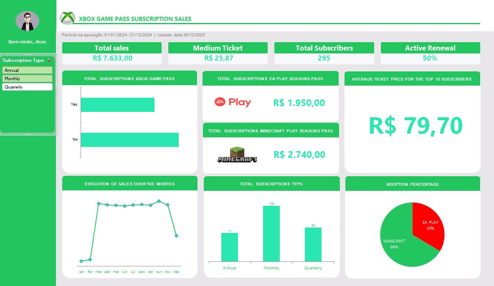

# 📊 Dashboard de Vendas - Assinaturas Ultimate

Este projeto consiste em um dashboard interativo criado no **Excel** para análise de uma base de 295 assinantes.

## 📈 Visualização do Dashboard
 
*(Esta linha faz o print aparecer direto na página)*

## 🔍 O que foi analisado:
- **KPIs Financeiros:** Faturamento Total, Ticket Médio e Ticket Médio do Top 10.
- **Retenção:** Percentual de renovação automática.
- **Produtos:** Taxa de adoção de itens adicionais (EA Play vs Minecraft).
- **Evolução:** Crescimento de vendas mês a mês.

## 🛠️ Tecnologias
- Microsoft Excel (Tabelas Dinâmicas, Fórmulas e Gráficos).
- Conceitos de Data Science: Limpeza de dados, Resample (agrupamento temporal) e Análise de Outliers.

## 📥 Como visualizar
1. Faça o download do arquivo `nome_do_seu_arquivo.xlsx`.
2. Abra no Microsoft Excel (recomendado habilitar as macros, se houver).
